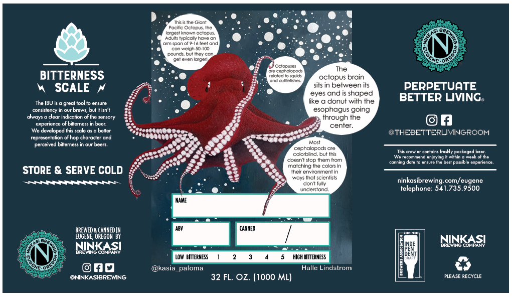

{: width="500" }{:style="display:block; margin-left:auto; margin-right:auto"}
I attended the Society for Integrative and Comparative Biology annual conference in January of 2023. I learned a lot about everything from what genes impact octopus development to mechanisms that give lizards the ability to hang on the ceiling. Most importantly, I left that meeting with new friends and a spark for science communication. I had a lot of ideas on how I could put science in places that people don’t normally see it, but I didn’t know exactly how to pursue these ideas since I had never received formal science communication training. Then I enrolled in the Science Outreach course at UO, where I was taught the basics of sci com and figured out how to turn some of these ideas into reality. I *naturally* decided to go with the biggest idea that I had, because that’s always a great place to start (this was originally sarcasm but the more I think about it the truer I think it is)! So, I went to Ninkasi brewing company and pitched them a can label that was covered in octopus facts, and after some back and forth, they said let’s make it happen!  

Now that I had people that were in support of this idea, I had to figure out how I was actually going to make it happen. I am full of hundreds of octopus facts, but I wasn’t sure that I could make a piece of art that I would want to be sold at a local brewery for all to see. So, I contacted Trish Mace, the director of the Charleston Marine Life Center, and asked if she could recommend any artists that could draw a realistic octopus. She introduced me to Halle Lindstrom, an undergraduate marine biology major who was an extremely talented artist but had never had her art on display or for sale! I reached out to Halle, and the rest is history... 

Except it's not! That was only the beginning. Halle collaborated with me on our design, which we appropriately named Sea Legs, and we broke records for the number of cans sold during our Sea Legs release party in September 2023. Then, 4 months later, I reached out to Halle about this huge idea to create a children’s  book. At the time, it wasn’t even a project: it didn't have a name, there was no game plan, and we weren't sure how we would fund this idea. But Halle, and our friend and my former lab mate Anneliese, agreed to help me make this happen!  

We have been extremely busy since January 2024. During the first half of the past year we spent many hours in the children’s book section of the library, identified 1st and 2nd graders as our target audience, and created a story line for our book. In the past six months, we have vetted our story line with book editors and 2nd grade classrooms, sketched out the entirety of the book, interviewed scientists from historically excluded groups, and much more. We turned our big idea into 'Dreams of a Scientist: Lessons from the Sea’, a children’s book that will break stereotypes and educate children and their support system!!  
