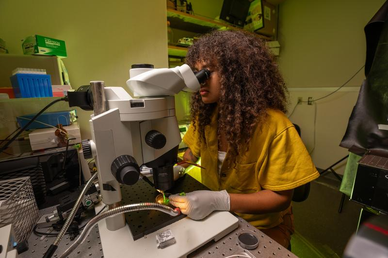

{: width="500" }{:style="display:block; margin-left:auto; margin-right:auto"}
### How Octopuses See Black, White, and an Aspect of Light We Can't See- Polarization

When I started in the [Niell lab](https://nielllab.uoregon.edu) I had never seen an octopus outside of aquarium walls and I had never heard of polarization vision. Fast forward four years, and I am now a PhD candidate studying how the octopus brain process differences in contrast, direction, and polarization. Thus far we have published our findings on how the octopus brain processes luminance, or brightness, based information. This was the first project that I was a part of, and you can read about [it here](https://www.cell.com/current-biology/fulltext/S0960-9822(23)00745-5)!
